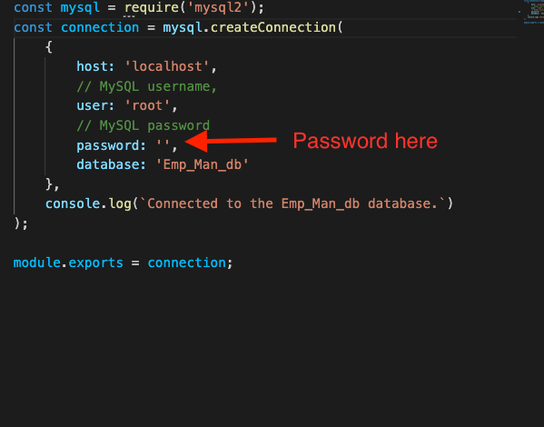

# 12 SQL: Employee Tracker
### Saghar Behinaein 
## Your Task

Developers frequently have to create interfaces that allow non-developers to easily view and interact with information stored in databases. These interfaces are called **content management systems (CMS)**. Your assignment this week is to build a command-line application from scratch to manage a company's employee database, using Node.js, Inquirer, and MySQL.

Because this application won’t be deployed, you’ll also need to create a walkthrough video that demonstrates its functionality and all of the following acceptance criteria being met. You’ll need to submit a link to the video and add it to the README of your project.

## User Story

```md
AS A business owner
I WANT to be able to view and manage the departments, roles, and employees in my company
SO THAT I can organize and plan my business
```
## Installation
Here are some guidelines to help you get started:

1. Clone the project in your laptop  
2. make sure you installed Node on your visual studio 
3.  Run the `npm init -y` comand in your terminal (your can see _package.json_ file in your folder)
4.  Run `npm install inquirer mysql2 mysql-promisify util` comand in your terminal to get all the libraries 
5.  insert your mysql password in in ./querirs/connection.js 
   sa you can see below:
   
 
6.  start the terminal from index.js
7.  run the `npm run schema` in terminal
8.  run the `npm run seeds` in terminal
9.  run the `node index.js`in terminal
   
## Demo Video
you can see demo video in the link below:  
[Demo Link](https://drive.google.com/file/d/1XGVRWMSMc2rNnAvIh75B01D1WzhBIe6W/view)
## My work
* when the index.js runs, it presented with the following options: view all departments, view all roles, view all employees, add a department, add a role, add an employee, and update an employee role
* By choosing to view all departments, it presented with a formatted table showing department names and department ids
* by choosing to view all roles, it presented with the job title, role id, the department that role belongs to, and the salary for that role
* by choosing to view all employees, it presented with a formatted table showing employee data, including employee ids, first names, last names, job titles, departments, salaries, and managers that the employees report to
* choose to add a department, it prompted to enter the name of the department and that department is added to the database
* By choosing to add a role, it prompted to enter the name, salary, and department for the role and that role is added to the database
* By choosing to add an employee, it prompted to enter the employee’s first name, last name, role, and manager, and that employee is added to the database
* By choosing to update an employee role, it prompted to select an employee to update and their new role and this information is updated in the database 

* By Deleting the departments,delete in the database .

* View the total utilized budget of a department


## Mock-Up

The following video shows an example of the application being used from the command line:

[](https://2u-20.wistia.com/medias/2lnle7xnpk)


